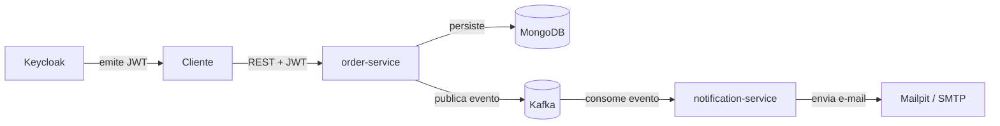

# Event Driven Kafka Basket

Microsserviços que simulam a cesta de compras de um e-commerce, com o ciclo de vida do pedido gerenciado por uma máquina de estados e comunicação entre serviços orientada a eventos com Apache Kafka. O projeto explora arquitetura de microsserviços, mensageria assíncrona, segurança stateless com OAuth2 e boas práticas de desenvolvimento.


## Visão geral

O sistema é composto por dois microsserviços que se comunicam de forma assíncrona por meio do Kafka:

- **order-service**: expõe a API REST de pedidos, controla o ciclo de vida do pedido por uma máquina de estados (Spring State Machine) e publica um evento no Kafka a cada mudança de status.
- **notification-service**: consome os eventos publicados e envia uma notificação por e-mail a cada mudança de status do pedido.

O fluxo de um pedido percorre os estados `CREATED`, `PAID`, `SHIPPED`, `DELIVERED` e `CANCELLED`, e cada transição gera um evento que o notification-service transforma em notificação.



## Tecnologias

- Java 17
- Spring Boot 3.3
- Spring Web
- Spring Security com OAuth2 Resource Server (JWT stateless)
- Spring State Machine
- Spring for Apache Kafka
- Spring Data MongoDB
- Keycloak (servidor de identidade)
- Apache Kafka com Zookeeper (mensageria)
- MongoDB (persistência)
- Mailpit (SMTP local para desenvolvimento)
- springdoc-openapi (Swagger UI)
- Docker e Docker Compose (infraestrutura)
- Maven em monorepo multi-módulo
- JUnit 5, Mockito e EmbeddedKafka (testes)
- GitHub Actions (CI e CD)

## Estrutura do projeto

O repositório é um monorepo Maven multi-módulo. Um POM pai centraliza as versões e agrega os dois serviços como módulos.

```
event-driven-basket/
├── docker/
│   └── docker-compose.yml       infraestrutura (Kafka, Zookeeper, MongoDB, Keycloak, Mailpit)
├── order-service/               API REST de pedidos + producer Kafka
├── notification-service/        consumidor Kafka + envio de e-mail
├── pom.xml                      POM pai (packaging pom)
└── README.md
```

Cada serviço segue uma separação por camadas: `controller`, `service`, `mapper`, `dto`, `entity`, `repository`, `config` e `exception`.

## Como executar

### Pré-requisitos

- Docker e Docker Compose
- JDK 17
- Maven 3.9 ou superior

Atenção com a versão do JDK: o projeto compila com Java 17. Confirme que o Maven está usando o JDK 17 com `mvn -v`. Caso o `JAVA_HOME` aponte para outra versão, ajuste antes de rodar.

### 1. Subir a infraestrutura

Na raiz do projeto:

```bash
docker compose -f docker/docker-compose.yml up -d
```

Isso sobe Kafka, Zookeeper, MongoDB, Keycloak e Mailpit.

### 2. Configurar o Keycloak

Acesse `http://localhost:8080` e entre com `admin` / `admin`. Em seguida:

1. Crie um realm chamado `basket`.
2. Crie um client chamado `order-service` (client público, com o fluxo Direct Access Grants habilitado).
3. Crie um usuário, defina uma senha não temporária e preencha e-mail, nome e sobrenome (o Keycloak exige o perfil completo para emitir token).

### 3. Rodar os serviços

Em terminais separados, a partir da raiz:

```bash
mvn -pl order-service spring-boot:run
```

```bash
mvn -pl notification-service spring-boot:run
```

O order-service sobe na porta 8081 e o notification-service na 8082.

## Autenticação

As rotas do order-service são protegidas por OAuth2 e exigem um token JWT emitido pelo Keycloak. Para obter um token:

```bash
curl -X POST http://localhost:8080/realms/basket/protocol/openid-connect/token \
  -d "client_id=order-service" \
  -d "grant_type=password" \
  -d "username=SEU_USUARIO" \
  -d "password=SUA_SENHA"
```

Use o `access_token` retornado no header `Authorization: Bearer TOKEN` das requisições.

## Testando o fluxo de ponta a ponta

Com a infraestrutura e os dois serviços no ar:

1. Obtenha um token (seção anterior).
2. Crie um pedido:

```bash
curl -X POST http://localhost:8081/orders \
  -H "Authorization: Bearer TOKEN" \
  -H "Content-Type: application/json" \
  -d '{"customerId":"1","basketId":"2","itemsAmount":100,"shippingCost":50}'
```

3. Avance o pedido pelos estados usando o `id` retornado:

```bash
curl -X POST http://localhost:8081/orders/{id}/pay \
  -H "Authorization: Bearer TOKEN" \
  -H "Content-Type: application/json" \
  -d '{"paymentMethod":"PIX"}'

curl -X POST http://localhost:8081/orders/{id}/ship -H "Authorization: Bearer TOKEN"
curl -X POST http://localhost:8081/orders/{id}/deliver -H "Authorization: Bearer TOKEN"
```

A cada transição, o order-service publica um evento no Kafka e o notification-service dispara uma notificação.

### Recebendo as notificações no seu próprio e-mail

O destinatário das notificações é configurável. No `application.yaml` do notification-service, defina o seu endereço:

```yaml
notification:
  mail:
    to: seu-email@exemplo.com
```

A partir daí, cada mudança de status do pedido gera um e-mail endereçado a você. Existem dois modos de visualizar:

1. Modo padrão com Mailpit: os e-mails são capturados localmente, sem envio real. Abra `http://localhost:8025` e veja as notificações chegando na caixa de entrada do Mailpit conforme você avança o pedido. Não precisa de nenhuma credencial.
2. Modo com SMTP real: troque a configuração `spring.mail` para um servidor SMTP de verdade (por exemplo, o SMTP do Gmail com uma senha de aplicativo). Nesse caso, as notificações chegam na sua caixa de e-mail real.

Isso torna o teste interativo: basta colocar o próprio e-mail e acompanhar as notificações chegando a cada etapa do pedido.

## Documentação da API

O order-service expõe documentação interativa via Swagger UI:

```
http://localhost:8081/swagger-ui.html
```

A interface lista todos os endpoints, os códigos de resposta (201, 400, 404, 409, 401) e possui um botão de autorização para colar o token JWT e testar as rotas diretamente pela tela.

## Decisões de arquitetura

Esta seção registra as principais decisões técnicas tomadas ao longo do desenvolvimento e o porquê de cada uma.

### Monorepo Maven multi-módulo

Os dois serviços vivem no mesmo repositório, com um POM pai agregando os módulos. A escolha do monorepo facilita versionar os dois serviços em conjunto, compartilhar configuração comum e subir todo o ambiente com um comando. A infraestrutura compartilhada (Kafka, Keycloak, MongoDB) fica em um único docker-compose na raiz, porque os dois serviços precisam do mesmo broker e do mesmo servidor de identidade.

### Máquina de estados para o ciclo de vida do pedido

O ciclo de vida do pedido é controlado por uma máquina de estados (Spring State Machine), e não por condicionais espalhadas pelo código. As transições válidas são declaradas em um único lugar. Uma tentativa de transição inválida, como enviar um pedido que ainda não foi pago, é rejeitada pela própria máquina. Isso centraliza a regra de negócio e evita que o pedido chegue a um estado inconsistente.

### Comunicação orientada a eventos com Kafka

A comunicação entre os serviços é assíncrona e desacoplada. O order-service publica um evento a cada mudança de status e não conhece quem consome. O notification-service reage aos eventos de forma independente. Esse desacoplamento permite adicionar novos consumidores no futuro sem alterar o produtor.

### Chave da mensagem igual ao orderId

Ao publicar no Kafka, o `orderId` é usado como chave da mensagem. Isso garante que todos os eventos de um mesmo pedido caiam na mesma partição e sejam consumidos em ordem. Sem uma chave, os eventos poderiam ser processados fora de ordem, o que quebraria a sequência natural de criação, pagamento, envio e entrega.

### Serialização JSON sem cabeçalho de tipo

O producer serializa as mensagens em JSON sem incluir o cabeçalho de tipo da classe. Isso evita acoplar o consumidor ao pacote e ao nome da classe do produtor, já que cada serviço tem sua própria representação da mensagem. O consumidor desserializa o JSON para a sua própria classe, definida com um tipo padrão, o que mantém os serviços independentes.

### Segurança stateless com OAuth2 e Keycloak

A autenticação usa JWT stateless. O order-service atua como Resource Server: valida o token emitido pelo Keycloak a cada requisição, sem manter sessão. As roles do realm são convertidas em authorities do Spring por um conversor customizado. Essa abordagem é adequada a microsserviços, já que cada requisição carrega o próprio token e não há estado de sessão para compartilhar entre instâncias.

### Separação entre domínio e contrato de API

As entradas e saídas da API usam DTOs dedicados, implementados como records imutáveis, separados da entidade de persistência. Isso evita expor a estrutura interna do banco na API e permite validar a entrada de forma isolada. O mapeamento entre DTO e entidade fica em uma camada de mapper dedicada.

### Identificador como String e valores monetários com BigDecimal

O identificador do pedido é uma String contendo um UUID, gerada na aplicação. Isso garante unicidade global sem coordenação entre instâncias, não vaza informação de volume e atravessa os serviços de forma limpa. Os valores monetários usam BigDecimal, e não tipos de ponto flutuante, para evitar imprecisão em cálculos de dinheiro.

### Endpoints por transição de estado

Em vez de um único endpoint genérico de atualização, cada transição tem seu próprio endpoint (`/pay`, `/ship`, `/deliver`, `/cancel`). Cada rota é autoexplicativa e recebe apenas o que precisa. Apenas o pagamento carrega um corpo, com a forma de pagamento. As demais transições precisam apenas do identificador do pedido.

### Tratamento global de exceções

Um handler global traduz as exceções de domínio em respostas HTTP corretas e com corpo padronizado: pedido não encontrado retorna 404, transição inválida retorna 409, erro de validação retorna 400 com os campos que falharam, e qualquer erro não previsto retorna 500 registrado no servidor. Isso substitui respostas genéricas por uma API previsível e fácil de consumir.

### Observabilidade por logs de negócio

Os marcos de negócio são registrados em log no nível informativo: criação do pedido, cada transição de estado e a publicação do evento no Kafka. Todos os logs usam o `orderId` como identificador de correlação, o que permite rastrear o ciclo de vida completo de um pedido pelos logs, da criação até a entrega, passando pela mensageria e chegando ao envio da notificação.

### Estratégia de testes

Os testes seguem a pirâmide de testes. A base concentra testes unitários rápidos e isolados, com mock das dependências, cobrindo o service, o mapper e o producer. Acima deles, um teste de integração com EmbeddedKafka valida o ponto de maior risco de configuração: a serialização e o consumo real de mensagens. Um dos testes garante que uma falha no envio de e-mail não derruba o consumo do Kafka, o que evitaria reprocessamento em laço.

### Integração e entrega contínuas

O projeto usa GitHub Actions. O pipeline de integração roda o build e os testes a cada pull request e a cada push na branch principal, em jobs paralelos por serviço. O pipeline de entrega constrói uma imagem Docker de cada serviço e a publica no GitHub Container Registry a cada merge na branch principal.

### Padrão de commits

As mensagens de commit seguem o padrão Conventional Commits, com o prefixo em inglês (`feat`, `fix`, `chore`, `docs`, `ci`, `refactor`) e a descrição em português. O fluxo de trabalho é baseado em branches e pull requests, com os testes do pipeline validando cada mudança antes do merge.

## Testes

Para rodar todos os testes do projeto, a partir da raiz:

```bash
mvn clean install
```

Para rodar apenas um módulo:

```bash
mvn -pl order-service test
mvn -pl notification-service test
```